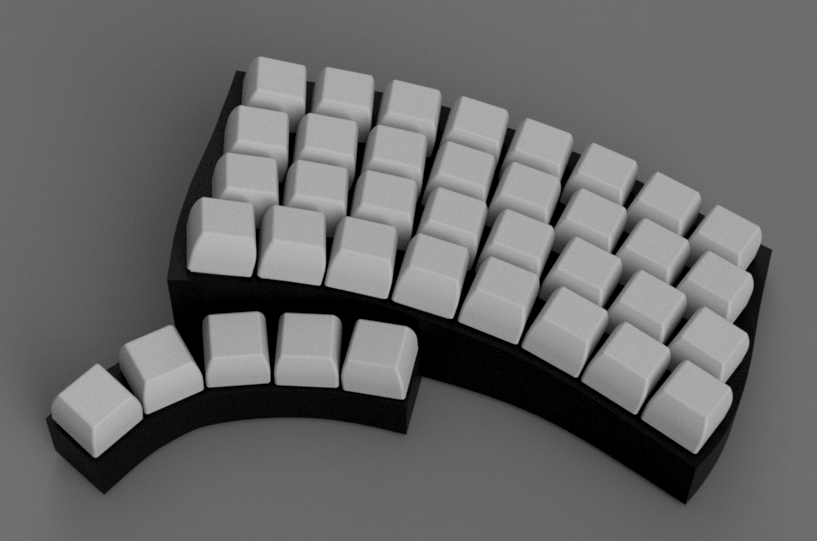
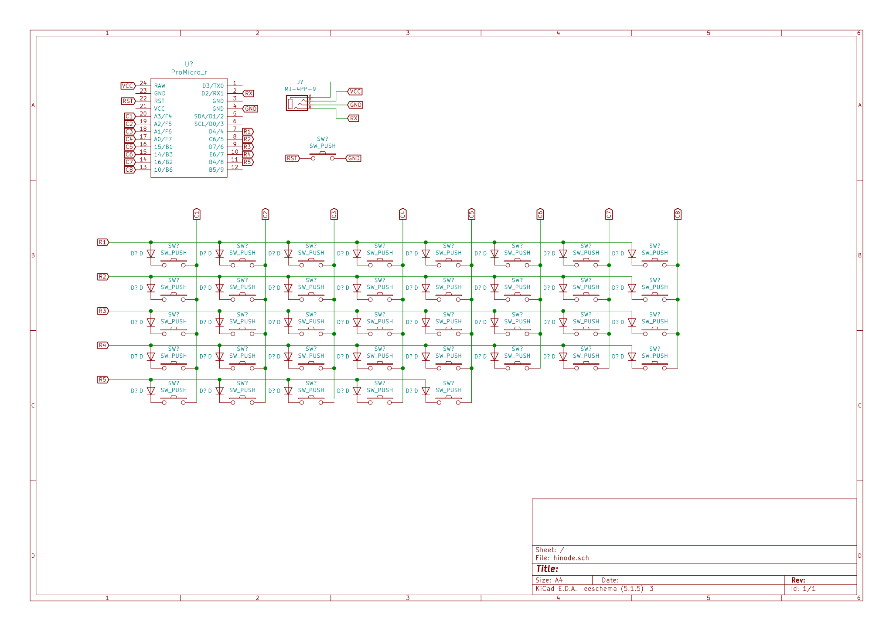

# hinode

手配線で作る自作キーボードです。  
ケースは3Dプリンターで作りました。

[需要あるかわかりませんがstlファイルも置いています。](./hinode.stl)

回路図です。

ファームウェアはhelixのものを編集して使っています。(うごいてない)

## ファームウェアのビルド方法

[https://github.com/qmk/qmk_firmware.git](https://github.com/qmk/qmk_firmware.git)  
をクローンしたディレクトリと同じ場所にこのリポジトリをクローンする。

